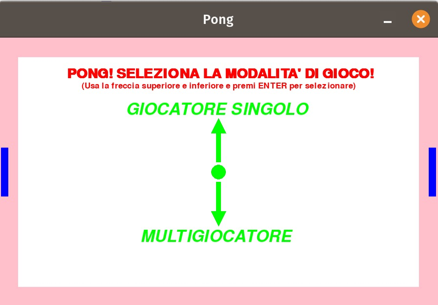
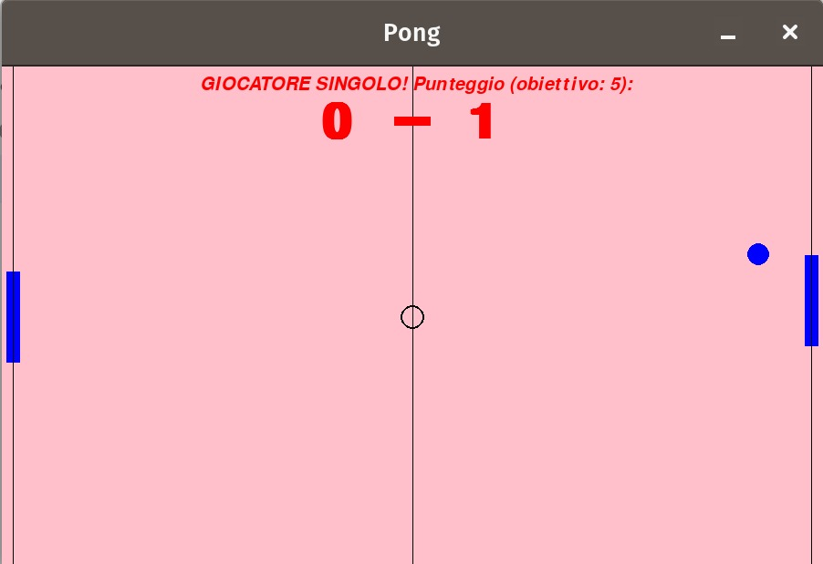

# 🏓 Pong Game (Python + Pygame)

This is a **Pong clone** I wrote back in 2019 during the last months of high school as one of my first real coding projects.  
It was my way to approach programming by mixing two passions: **videogames and coding** 🎮.

👉 **Download Linux executable from here: https://albycosmy99.itch.io/pong-game**  

---

## 🚀 Features

- Classic **Pong gameplay** with two paddles and a bouncing ball  
- **Single-player mode**: play against a basic AI-controlled paddle  
- **Multiplayer mode**: two players on the same keyboard  
- **Start screen**: select game mode before playing  
- **Score system** with configurable goal (default: 5 points)  
- **Victory screen** ("Congratulazioni!") when a player wins  
- Background music and sound effects using `pygame.mixer`

---

## 🎮 Controls

### Single-player
- **Arrow Up / Down** → Move your paddle  
- The second paddle is controlled automatically

### Multiplayer
- **W / S** → Move left paddle  
- **Arrow Up / Down** → Move right paddle  

---

## 📂 Project structure

```
.
├── pong.py                     # Main game file
├── pong_musica.mp3             # Background music
├── pong_schermata_iniziale.mp3 # Intro screen music
└── README.md                   # Project description
```

---

## 🛠️ Requirements

- Python 3.x  
- [`pygame`](https://www.pygame.org/news) library  

Install pygame with:

```bash
pip install pygame
```

---

## ▶️ Run the game

From terminal:

```bash
python pong.py
```

Then select **single-player** or **multiplayer** mode on the start screen and play!

---

## 📖 Example gameplay

- A ball starts bouncing in the middle of the screen.  
- Players move paddles to prevent the ball from going out of bounds.  
- Each time a player misses, the opponent gains a point.  
- The first player to reach the goal score (default: 5) wins the game.  

---

## ✨ Future improvements

- Better ball behaviour 
- Add sounds for paddle/ball collisions  
- Improve the "congratulations" victory screen   

---

👉 This project is special to me because it represents my **first step into programming**: building a classic game from scratch while learning Python, back in 2019.

---

## 📸 Screenshot


